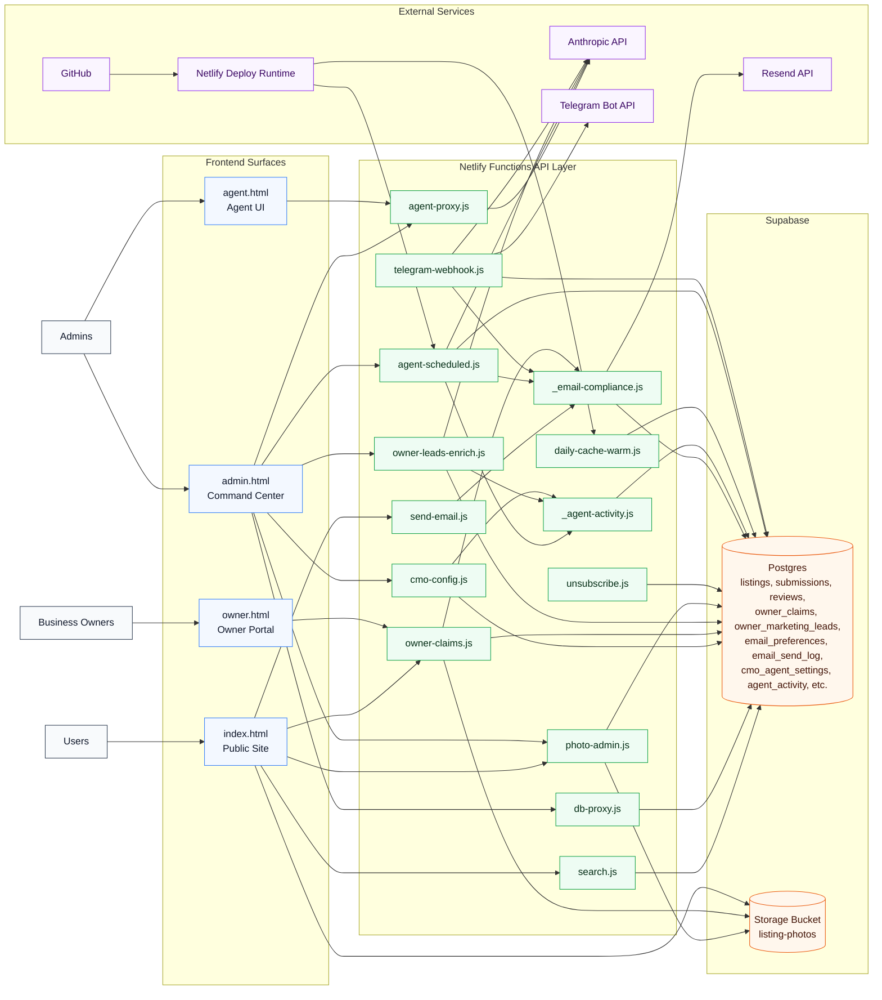
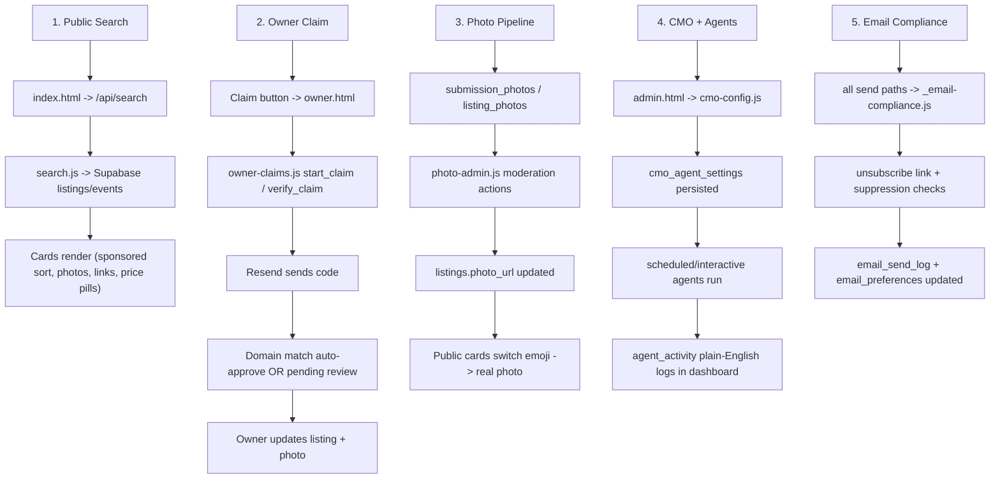

# KiddBusy Data Flow (Visual)

## System Flowchart

```mermaid
flowchart LR
  %% -------------------------
  %% Frontend surfaces
  %% -------------------------
  subgraph FE["Frontend Surfaces"]
    IDX["index.html<br/>Public Site"]
    ADM["admin.html<br/>Command Center"]
    OWN["owner.html<br/>Owner Portal"]
    AGU["agent.html<br/>Agent UI"]
  end

  %% -------------------------
  %% Netlify API layer
  %% -------------------------
  subgraph NF["Netlify Functions API Layer"]
    SEARCH["search.js"]
    DBP["db-proxy.js"]
    CMO["cmo-config.js"]
    OCLAIM["owner-claims.js"]
    OLEAD["owner-leads-enrich.js"]
    PHOTO["photo-admin.js"]
    SMAIL["send-email.js"]
    UNSUB["unsubscribe.js"]
    APROXY["agent-proxy.js"]
    ASCHED["agent-scheduled.js"]
    WARM["daily-cache-warm.js"]
    TEL["telegram-webhook.js"]
    ECOMP["_email-compliance.js"]
    ALOG["_agent-activity.js"]
  end

  %% -------------------------
  %% Data and external systems
  %% -------------------------
  subgraph DATA["Supabase"]
    DB[("Postgres<br/>listings, submissions, reviews,<br/>owner_claims, owner_marketing_leads,<br/>email_preferences, email_send_log,<br/>cmo_agent_settings, agent_activity, etc.")]
    ST[("Storage Bucket<br/>listing-photos")]
  end

  subgraph EXT["External Services"]
    ANT["Anthropic API"]
    RES["Resend API"]
    TLG["Telegram Bot API"]
    GH["GitHub"]
    NET["Netlify Deploy Runtime"]
  end

  %% -------------------------
  %% User -> frontend
  %% -------------------------
  USER["Users"]
  OWNERUSR["Business Owners"]
  ADMINUSR["Admins"]

  USER --> IDX
  OWNERUSR --> OWN
  ADMINUSR --> ADM
  ADMINUSR --> AGU

  %% -------------------------
  %% Frontend -> functions
  %% -------------------------
  IDX --> SEARCH
  IDX --> PHOTO
  IDX --> OCLAIM
  IDX --> SMAIL

  ADM --> DBP
  ADM --> CMO
  ADM --> PHOTO
  ADM --> OLEAD
  ADM --> ASCHED
  ADM --> APROXY

  OWN --> OCLAIM
  AGU --> APROXY

  %% -------------------------
  %% Function internals
  %% -------------------------
  APROXY --> ANT
  ASCHED --> ANT
  OLEAD --> ANT
  TEL --> ANT

  SMAIL --> ECOMP
  ASCHED --> ECOMP
  TEL --> ECOMP
  OCLAIM --> ECOMP
  ECOMP --> RES

  ASCHED --> ALOG
  OLEAD --> ALOG
  CMO --> ALOG

  %% -------------------------
  %% Functions -> Supabase
  %% -------------------------
  SEARCH --> DB
  DBP --> DB
  CMO --> DB
  OCLAIM --> DB
  OLEAD --> DB
  PHOTO --> DB
  UNSUB --> DB
  ECOMP --> DB
  ALOG --> DB
  WARM --> DB
  ASCHED --> DB
  TEL --> DB

  PHOTO --> ST
  OCLAIM --> ST
  IDX --> ST

  %% -------------------------
  %% Schedules and deployment
  %% -------------------------
  GH --> NET
  NET --> ASCHED
  NET --> WARM

  %% -------------------------
  %% Notifications
  %% -------------------------
  TEL --> TLG

  %% -------------------------
  %% Styling
  %% -------------------------
  classDef front fill:#f3f8ff,stroke:#3b82f6,stroke-width:1px,color:#0f172a;
  classDef func fill:#eefcf3,stroke:#16a34a,stroke-width:1px,color:#052e16;
  classDef data fill:#fff7ed,stroke:#ea580c,stroke-width:1px,color:#431407;
  classDef ext fill:#faf5ff,stroke:#9333ea,stroke-width:1px,color:#3b0764;
  classDef user fill:#f8fafc,stroke:#334155,stroke-width:1px,color:#0f172a;

  class IDX,ADM,OWN,AGU front;
  class SEARCH,DBP,CMO,OCLAIM,OLEAD,PHOTO,SMAIL,UNSUB,APROXY,ASCHED,WARM,TEL,ECOMP,ALOG func;
  class DB,ST data;
  class ANT,RES,TLG,GH,NET ext;
  class USER,OWNERUSR,ADMINUSR user;
```

## Key Operational Paths

```mermaid
flowchart TD
  A["1. Public Search"] --> A1["index.html -> /api/search"]
  A1 --> A2["search.js -> Supabase listings/events"]
  A2 --> A3["Cards render (sponsored sort, photos, links, price pills)"]

  B["2. Owner Claim"] --> B1["Claim button -> owner.html"]
  B1 --> B2["owner-claims.js start_claim / verify_claim"]
  B2 --> B3["Resend sends code"]
  B3 --> B4["Domain match auto-approve OR pending review"]
  B4 --> B5["Owner updates listing + photo"]

  C["3. Photo Pipeline"] --> C1["submission_photos / listing_photos"]
  C1 --> C2["photo-admin.js moderation actions"]
  C2 --> C3["listings.photo_url updated"]
  C3 --> C4["Public cards switch emoji -> real photo"]

  D["4. CMO + Agents"] --> D1["admin.html -> cmo-config.js"]
  D1 --> D2["cmo_agent_settings persisted"]
  D2 --> D3["scheduled/interactive agents run"]
  D3 --> D4["agent_activity plain-English logs in dashboard"]

  E["5. Email Compliance"] --> E1["all send paths -> _email-compliance.js"]
  E1 --> E2["unsubscribe link + suppression checks"]
  E2 --> E3["email_send_log + email_preferences updated"]
```

